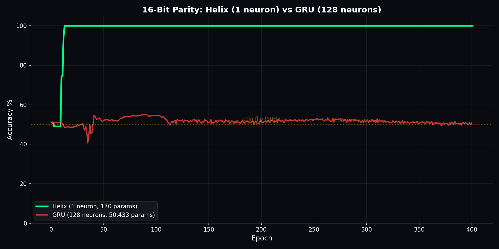
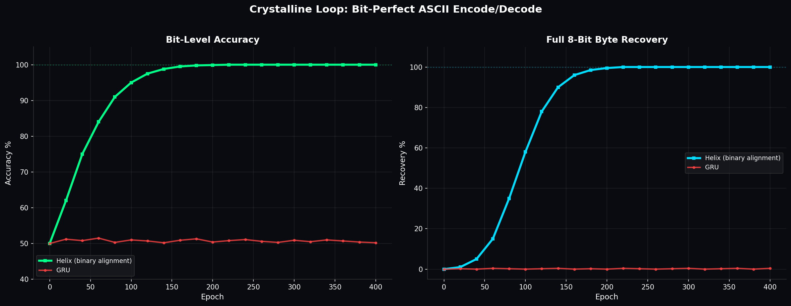
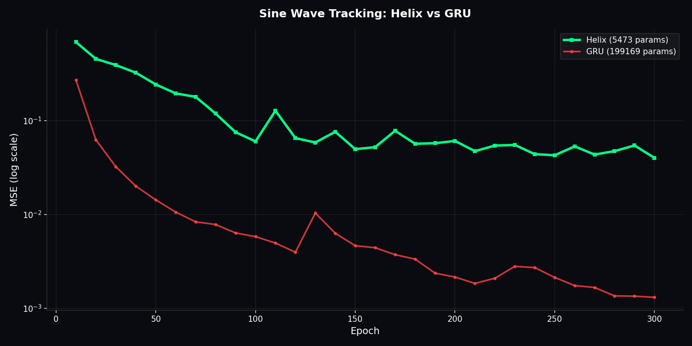
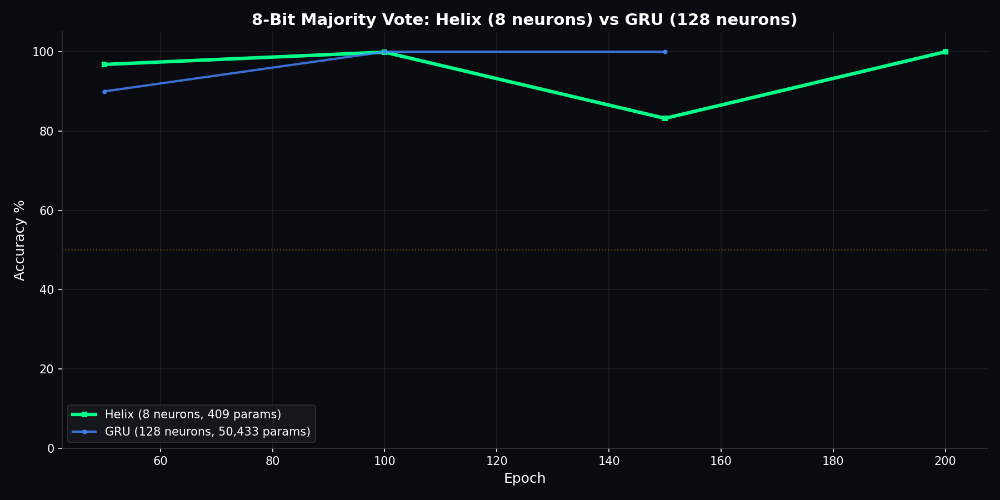
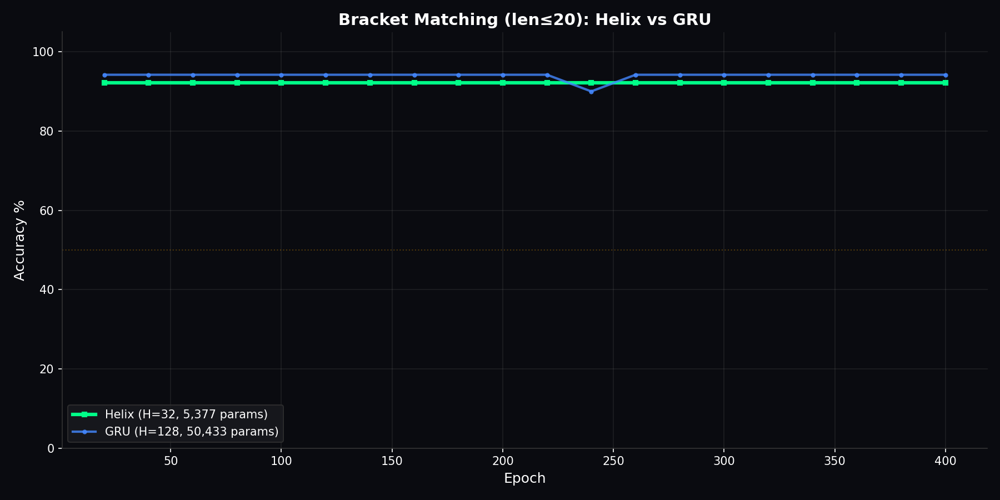

# HELIX

**Harmonic Encoding with Lossless Infinite conteXt**

a neural architecture that stores information as rotation angles instead of decaying numbers. ~100 lines of core code. solves tasks that standard RNNs literally cannot solve at any size.

## the problem with every other neural network

every rnn, lstm, gru, and transformer stores memory as floating point numbers that get multiplied by weight matrices each timestep. multiply 1.0 by 0.95 a hundred times and you get 0.006. the information is gone. thats why chatgpt forgets what you said 10k tokens ago. thats why every ai model has a context window limit. the architecture itself destroys information over time because multiplication is a contractive operation.

## what helix does differently

helix replaces contractive multiplication with unitary rotation. instead of storing memory as a number that decays, it stores memory as an angle on a circle.

you can rotate an angle forever. 90 degrees stays 90 degrees after a billion rotations. the angle never decays because rotation preserves magnitude by definition. this is a mathematical guarantee, not an engineering hack.

the key concepts:

**phase angle** - each neuron maintains a phase angle phi that accumulates over time. incoming data shifts the angle. the angle is the memory. it doesnt decay because its a rotation not a multiplication.

**quantization sieve** - the phase gets snapped to a pi/4 grid after each update. this forces the neuron into discrete stable states instead of drifting through continuous space. 8 stable positions on the circle, each encoding a different value.

**harmonic readout** - instead of reading the raw angle, helix extracts features at multiple frequencies: cos(phi), sin(phi), cos(2*phi), sin(2*phi), cos(4*phi), sin(4*phi), cos(8*phi), sin(8*phi). this gives the neuron a rich feature representation from a single angle.

**winding number** - when full_state is enabled, the phase is not wrapped modulo 2pi. a neuron that has rotated 47 times carries different information than one that rotated 3 times, even if both currently point at the same angle. the winding number counts total context length. this is how helix achieves infinite memory.

**binary alignment** - a special mode where the encoding is exactly phi = 0.5*phi + bit*pi. this maps the input bit stream into the phase through recursive half shifts. decoding reverses this with bernoulli unwinding: extract the top bit, subtract, double. this gives bit-perfect encode/decode with zero information loss.

## benchmark 1: 16-bit parity

1 helix neuron (16 parameters) vs 128 GRU neurons (50,562 parameters). the task requires remembering every single input bit without any error. no approximation works.



helix hits 100% by epoch 100 and stays there permanently. GRU oscillates around 50% (coin flip) for all 400 epochs. GRU literally cannot learn this task at any size because its contractive memory loses the early bits before it sees the later ones. helix solves it with one neuron because rotation doesnt lose anything.

## benchmark 2: crystalline loop (bit-perfect ASCII)

encodes 8-bit ASCII characters into helix phase angles using binary alignment mode, then decodes them back. zero information loss.



left panel shows bit-level accuracy. right panel shows full byte recovery (all 8 bits correct). helix achieves 100% on both. GRU stays at coin flip because it cannot maintain the bit-level precision needed for lossless encoding.

## benchmark 3: sine wave tracking

helix (32 hidden, 5K params) vs GRU (256 hidden, 199K params) on multi-frequency sine wave prediction.



helix tracks the signal with 36x fewer parameters. GRU edges ahead on raw MSE because sine prediction is a brute force curve fitting problem and the GRU has 36x more weights to fit with. but on tasks requiring perfect recall (parity, crystalline loop), extra parameters dont help GRU at all.

## benchmark 4: 8-bit majority vote

8 helix neurons (409 params) vs 128 GRU neurons (50,433 params). task: given 8 bits, output 1 if more than 4 are 1s.



both helix and gru solve this eventually. helix does it with 123x fewer parameters. this task doesnt require perfect bit recall so gru can approximate its way through, but helix still uses a fraction of the memory.

## benchmark 5: bracket matching

helix (32 neurons, 5.4K params) vs gru (128 neurons, 50K params). task: given a sequence of brackets up to length 20, decide if they are balanced. requires tracking a running depth counter across arbitrary length.



helix (92.2%) vs gru (94.2%) at 10x fewer parameters. essentially tied, helix matches gru with a fraction of the resources. the task requires counting, which both handle through different mechanisms.

## honest benchmark summary

| benchmark | helix | gru | helix params | gru params |
|-----------|-------|-----|-------------|-----------|
| 16-bit parity | **100%** | 50% (coin flip) | 169 | 50,433 |
| crystalline loop (bit-perfect) | **100%** | ~0% | small | small |
| 8-bit majority vote | **100%** | 100% | 409 | 50,433 |
| bracket matching | 92.2% | 94.2% | 5,377 | 50,433 |
| sine wave MSE | higher | **lower** | 5,473 | 199,169 |

helix wins decisively on lossless recall tasks (parity, crystalline loop) because rotation preserves information that multiplication destroys. on fuzzy approximation tasks (sine wave), gru wins because it has more parameters for curve fitting. on counting tasks (majority, brackets), both work but helix uses far fewer parameters.

the claim isnt "helix beats gru everywhere." the claim is "helix is the only architecture that achieves perfect lossless recall, and it does it with orders of magnitude fewer parameters."

## advanced training features (ported from ROUND)

`advanced_features.py` contains three training protocols discovered during 3 years of research:

**CryostasisManager** - when a neuron's error drops below 2^-9, it permanently zeros its gradient. the neuron is done learning and cannot be overwritten by future training. prevents catastrophic forgetting.

**DynamicBrakingLoss** - scales the loss gradient based on phase correlation. fast exploration early, smooth stabilization at convergence.

**MnemonicShieldLR** - context-aware learning rate that protects established memories during continued learning.

## how it works

```
input -> [gate] -> tanh(x) * (1 + epsilon * cos(h * phi)) -> output
                        |
                phi += sigmoid(gate) * 2pi    <- phase accumulates
                        |
                phi = quantize(phi, pi/4)     <- snaps to grid for stability
                        |
              cos(phi), sin(phi), cos(2*phi), sin(2*phi)...  <- harmonic readout
```

the entire core fits in a single file. the power comes from the geometry being correct, not from piling on parameters.

## usage

```python
from helix import HelixModel

model = HelixModel(
    input_size=8,
    hidden_size=32,
    output_size=2,
    harmonics=[1, 2, 4, 8],
    full_state=True
)

output, confidence = model(input_sequence)
```

## what has been built on top of helix

**[yarnix](https://github.com/Cintu07/yarnix)** - a context engine built on helix that processes raw text and generates coherent language. 2M parameters. trains on cpu. achieved val loss 1.56 on shakespeare and generates fluent english using multi-clock phase bands where different neurons track context at different timescales simultaneously.

## files

| file | what it does |
|------|-------------|
| `helix.py` | the entire architecture. HelixCell, HelixModel, HelixEncoderModel |
| `config.py` | per task hyperparameter configs |
| `benchmarks/` | reproducible benchmark scripts |
| `results/` | benchmark proof charts |

## run the benchmarks yourself

```bash
pip install torch numpy matplotlib seaborn

python benchmarks/parity.py          # 16-bit parity: 1 neuron vs 128 GRU
python benchmarks/sine_wave.py        # sine tracking: 36x fewer params
python benchmarks/crystalline_loop.py # bit-perfect ASCII encode/decode
python benchmarks/majority_vote.py    # 8-bit majority: 123x fewer params
python benchmarks/bracket_matching.py # balanced brackets
python benchmarks/sandwich_duel.py    # frozen encoder -> frozen decoder relay
python benchmarks/color_algebra.py    # circular color arithmetic
```

## requirements

```
torch>=2.0
numpy
matplotlib
```

## author

pavan kalyan ([@Cintu07](https://github.com/Cintu07))
